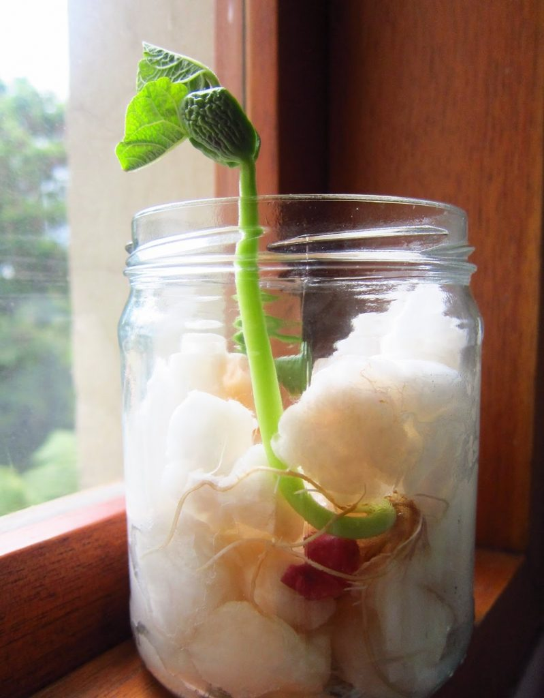

# Proyecto_TICS

     
    <em>Porotito en crecimiento.</em>

 

 

Hola! Nuestro proyecto trata de crear una aplicación que a partir de mediciones de la humedad y temperatura, logre avisar cuando una planta requiere ser regada o protegida de la temperatura a su alrededor.

